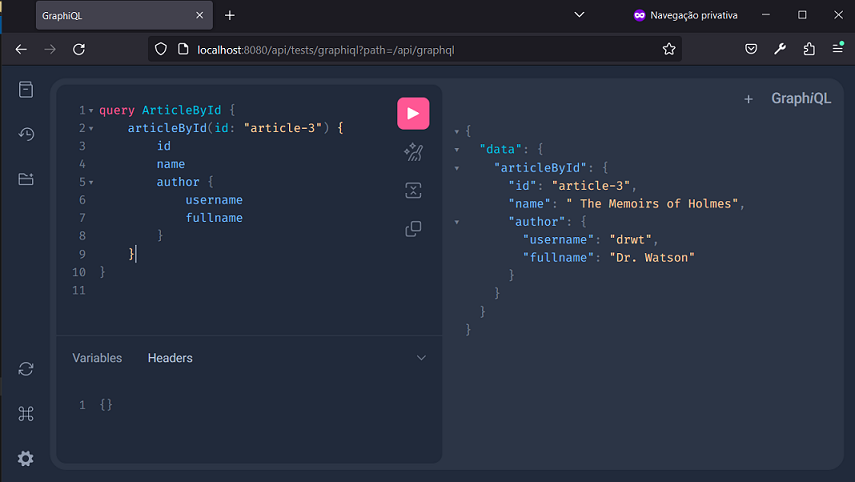
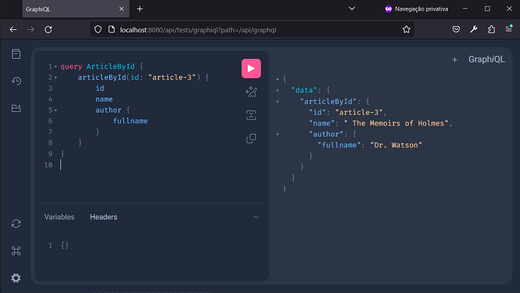

# Spring - GraphQL - Articles
Projeto Java com Spring e Gradle para criar uma aplicação GraphQL de Articles.


## Passos
Os passos da implementação do projeto:

1. Criar projeto (no IntelliJ) com:
- Linguagem Java (17);
- Spring Framework (6.2.3);
- Dependências: Web, GraphQL, DevTools e Lombok.


2. Em `src/main/resources/graphql`, criar `schema.graphqls` ou `schema.gqls`:
- A consulta é buscar artigo pelo seu id;
- Cada artigo possui id, name, author;
- Cada author pode possuir id, fullname, username.

```graphql
type Query {
  articleById(id: ID): Article
}

type Article {
    id: ID
    name: String
    author: Author
}

type Author {
    id: ID
    fullname: String
    username: String
}
```

3. Criar `record Author`:
- com campos `id`, `fullname`, `username` do tipo String;
- com campo `static authorList`;
- com método `static Author getById(String id)`.

```java
package com.project.javaspringgraphqlarticles.data;
public record Author(String id, String fullname, String username) {

    private static List<Author> authorList = Arrays.asList(
            new Author("author-1", "Arthur Ignatius Conan Doyle", "aicd"),
            new Author("author-2", "Researcher Holmes", "rshlm"),
            new Author("author-3", "Dr. Watson", "drwt")
    );
  
    public static Author getById(String id){
      return Author.authorList
              .stream()
              .filter(author -> author.id().equals(id))
              .findFirst().orElse(null);
    }
}
```

4. Criar `record Article`:
- com campos `id`, `name`, `authorId` do tipo String;
- com campo `static articleList`;
- com método `static Article getById(String id)`.

```java
package com.project.javaspringgraphqlarticles.data;
public record Article(String id, String name, String authorId) {

    private static List<Article> articleList = Arrays.asList(
            new Article("article-1", "A study in scarlet red", "author-1"),
            new Article("article-2", "A Sherlock Adventure", "author-2"),
            new Article("article-3", " The Memoirs of Holmes", "author-3")
    );
  
    public static Article getById(String id){
      return Article.articleList
              .stream()
              .filter(article -> article.id().equals(id))
              .findFirst()
              .orElse(null);
    }
}
```

5. Criar classe `ArticleController`:
- no pacote `controllers`;
- anotada com `@Controller`;
- com os métodos:
    * `@QueryMapping public Article articleById(@Argument String id)`;
    * `@SchemaMapping public Author author(Article article)`.

```java
package com.project.javaspringgraphqlarticles.controllers;
@Controller
public class ArticleController {

    @QueryMapping
    public Article articleById(@Argument String id){
        return Article.getById(id);
    }

    @SchemaMapping
    public Author author(Article article){
        return Author.getById(article.authorId());
    }
}
```

6. Configurar `application.properties` para:
- definir rota da api graphql como `/api/graphql`;
- ativar graphiql;
- definir rota da api graphiql como `api/tests/graphiql`.

```properties
spring.application.name=Java-Spring-GraphQL-Articles
spring.graphql.path=/api/graphql
spring.graphql.graphiql.enabled=true
spring.graphql.graphiql.path=api/tests/graphiql
```

7. Para testar, acesse `http://localhost:8080/api/tests/graphiql?path=/api/graphql` com o navegador (ou use o POSTMAN):







Obs.:
- Os nomes em Query `schema.graphqls` devem ser os mesmos dos métodos das Controllers anotados com `@QueryMapping`.


## Referências
Baeldung - Getting Started with GraphQL and Spring Boot:
https://www.baeldung.com/spring-graphql

Baeldung - Introduction to GraphQL:
https://www.baeldung.com/graphql

Spring - Guides - Building a GraphQL service:
https://spring.io/guides/gs/graphql-server

GraphQL Java - Tutorial - Getting started with Spring for GraphQL:
https://www.graphql-java.com/tutorials/getting-started-with-spring-boot/