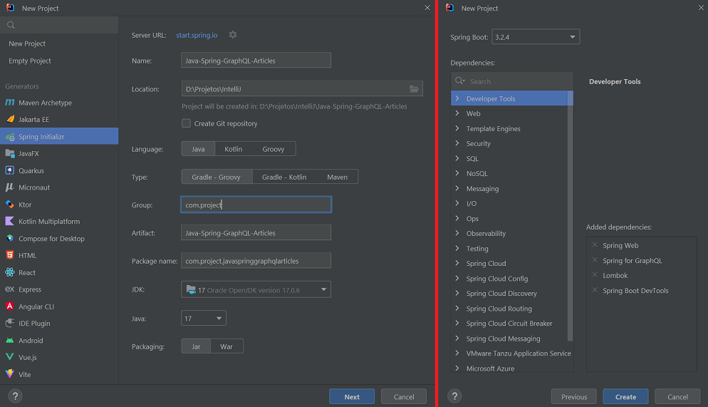
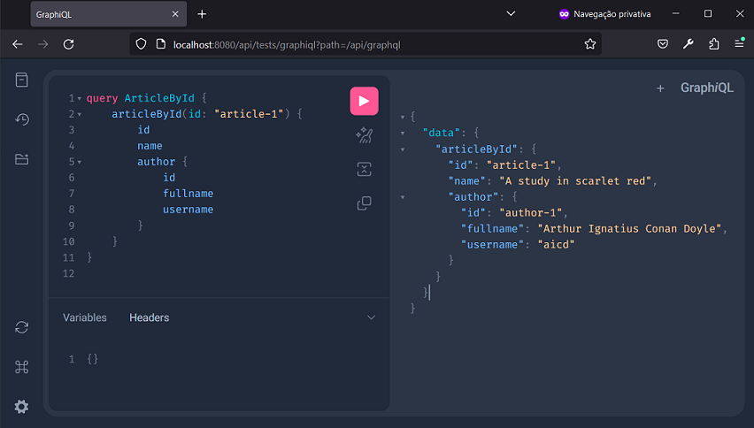
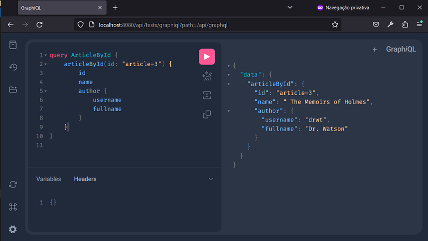
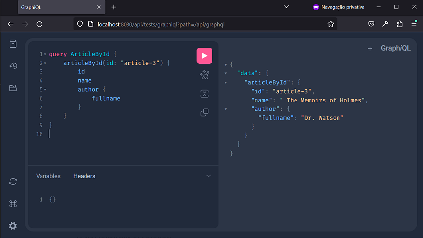
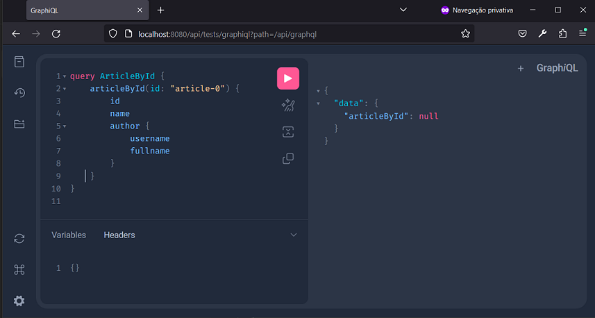

# Spring - GraphQL - Articles
Java project with Spring and Gradle to create a GraphQL Articles application.


## Steps
The steps of project implementation:

1. Create project (in IntelliJ) with:
- Java language (17);
- Spring Framework (6.2.3);
- Dependencies: Web, GraphQL, DevTools and Lombok.



2. In `src/main/resources/graphql`, create `schema.graphqls` or `schema.gqls`:
- The query is to search for an article by its id;
- Each article has id, name, author;
- Each author can have id, fullname, username.

```graphql
type Query {
  articleById(id: ID): Article
}

type Article {
    id: ID
    name: String
    author: Author
}

type Author {
    id: ID
    fullname: String
    username: String
}
```

3. Create `record Author`:
- with fields `id`, `fullname`, `username` of type String;
- with `static authorList` field;
- with `static Author getById(String id)` method.

```java
package com.project.javaspringgraphqlarticles.data;
public record Author(String id, String fullname, String username) {

    private static List<Author> authorList = Arrays.asList(
            new Author("author-1", "Arthur Ignatius Conan Doyle", "aicd"),
            new Author("author-2", "Researcher Holmes", "rshlm"),
            new Author("author-3", "Dr. Watson", "drwt")
    );
  
    public static Author getById(String id){
      return Author.authorList
              .stream()
              .filter(author -> author.id().equals(id))
              .findFirst().orElse(null);
    }
}
```

4. Create `record Article`:
- with fields `id`, `name`, `authorId` of type String;
- with `static articleList` field;
- with `static Article getById(String id)` method.

```java
package com.project.javaspringgraphqlarticles.data;
public record Article(String id, String name, String authorId) {

    private static List<Article> articleList = Arrays.asList(
            new Article("article-1", "A study in scarlet red", "author-1"),
            new Article("article-2", "A Sherlock Adventure", "author-2"),
            new Article("article-3", " The Memoirs of Holmes", "author-3")
    );
  
    public static Article getById(String id){
      return Article.articleList
              .stream()
              .filter(article -> article.id().equals(id))
              .findFirst()
              .orElse(null);
    }
}
```

5. Create `ArticleController` class:
- in the `controllers` package;
- annotated with `@Controller`;
- with the methods:
    * `@QueryMapping public Article articleById(@Argument String id)`;
    * `@SchemaMapping public Author(Article article)`.

```java
package com.project.javaspringgraphqlarticles.controllers;
@Controller
public class ArticleController {

    @QueryMapping
    public Article articleById(@Argument String id){
        return Article.getById(id);
    }

    @SchemaMapping
    public Author author(Article article){
        return Author.getById(article.authorId());
    }
}
```

6. Configure `application.properties` to:
- define graphql api route as `/api/graphql`;
- activate graphiql;
- set graphiql api route to `api/tests/graphiql`.

```properties
spring.application.name=Java-Spring-GraphQL-Articles
spring.graphql.path=/api/graphql
spring.graphql.graphiql.enabled=true
spring.graphql.graphiql.path=api/tests/graphiql
```

7. To test, access `http://localhost:8080/api/tests/graphiql?path=/api/graphql` with your browser (or use POSTMAN):









Note:
- The names in Query `schema.graphqls` must be the same as the Controllers methods annotated with `@QueryMapping`.


## References
Baeldung - Getting Started with GraphQL and Spring Boot:
https://www.baeldung.com/spring-graphql

Baeldung - Introduction to GraphQL:
https://www.baeldung.com/graphql

Spring - Guides - Building a GraphQL service:
https://spring.io/guides/gs/graphql-server

GraphQL Java - Tutorial - Getting started with Spring for GraphQL:
https://www.graphql-java.com/tutorials/getting-started-with-spring-boot/